<!DOCTYPE html PUBLIC "-//W3C//DTD XHTML 1.0 Transitional//EN" "http://www.w3.org/TR/xhtml1/DTD/xhtml1-transitional.dtd">
<html xmlns="http://www.w3.org/1999/xhtml">
<meta http-equiv="Content-Type" content="text/html; charset=utf-8" />

<body>

<strong>Introduction</strong> 
  This  solution is intended for owners of Nartis-I100 split electric meters, when the  meter comes with a Nartis-D101 remote display and requires the transmission of  readings to the Home Assistant.

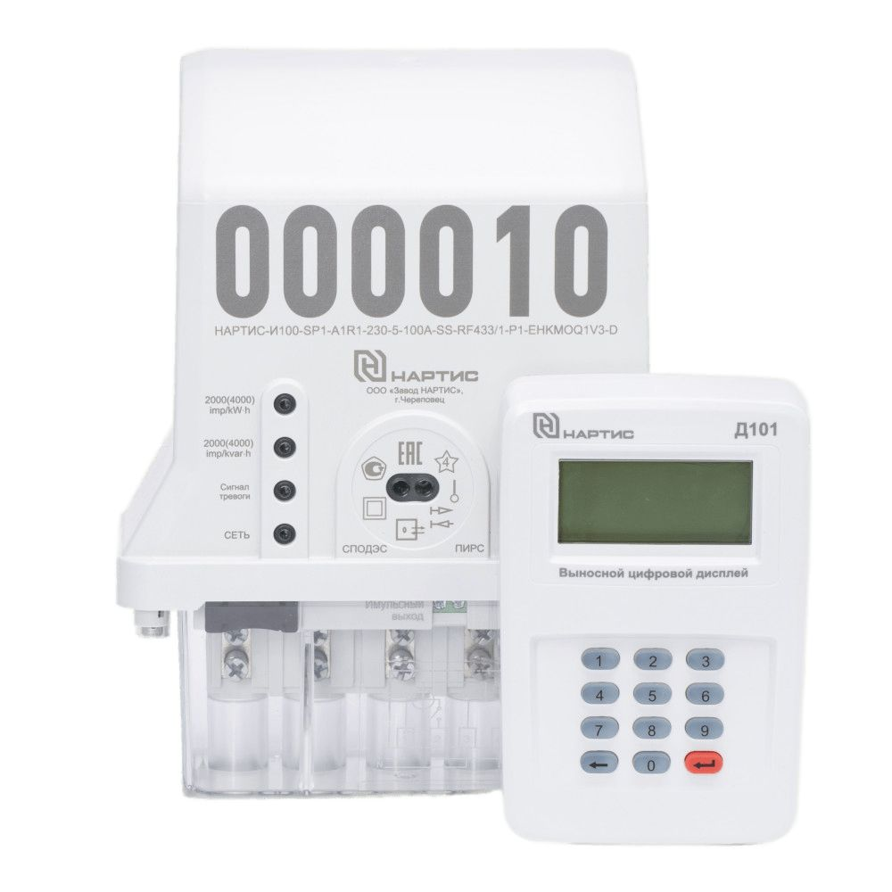 

There are  several other options for receiving readings from Nartis and then transmitting  them to a smart home: via an optoport or an RF-433 wireless USB module.  However, these solutions have their limitations. So connecting via an optoport  requires laying a cable to an electric meter, which is not always possible, and  integration via an expensive wireless USB module uses a slow and not very  stable SPODES protocol. 
  

The  Nartis-D101 remote display interacts with the electric meter wirelessly at a  frequency of 433MHz using the relatively fast Wireless ModBUS protocol, while  the transmitted data is encrypted using the AES-128 GCM method and cannot be  decoded without the appropriate keys. 

 
  When  analyzing the device itself, it was found that the HT6027 MCU, on the basis of  which the device is implemented, actively exchanges with external FLASH memory  based on EN25S80 during operation. So, eight minutes after connecting the power  supply via the USB connector, the Nartis-D101 reads the readings from the  electric meter and two minutes later writes them to FLASH memory via the SPI  bus. Then this operation is repeated every hour in automatic mode.

 
  The ESP32  module was selected to read the SPI bus, but during testing it turned out that  when using conventional commands such as digitalRead(PIN_MOSI) or return  GPIO.in&amp;MOSI_MASK, system performance is insufficient, since the exchange  between the Nartis-D101 components is performed at a fairly high frequency of  10 MHz.

 
  The ESP32  has a special I2S+DMA reading mode, which allows you to record pin states  directly into RAM with minimal CPU usage, while the module's performance is  sufficient for successful operation, as demonstrated by the <a href="https://github.com/lmcapacho/ESP32_LogicAnalyzer">ESP32_LogicAnalyzer  project from lmcapacho</a>.

<strong>Equipment:</strong> 
  1. Remote  display Nartis-D101 
  2. 30-pin  ESP32 module based on ESP-32-D0WD-V3 chip (revision 3.1) 
  3. Wires 
  4. Soldering iron

<table width="50%" border="0" align="center">
  <tr>
    <td>
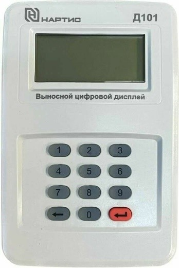
</td>
    <td>
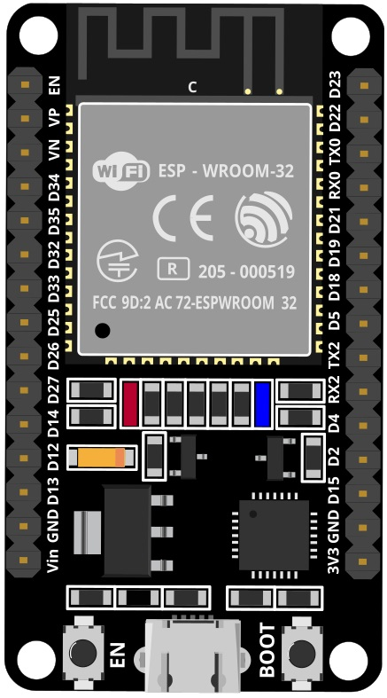
</td>
    <td>
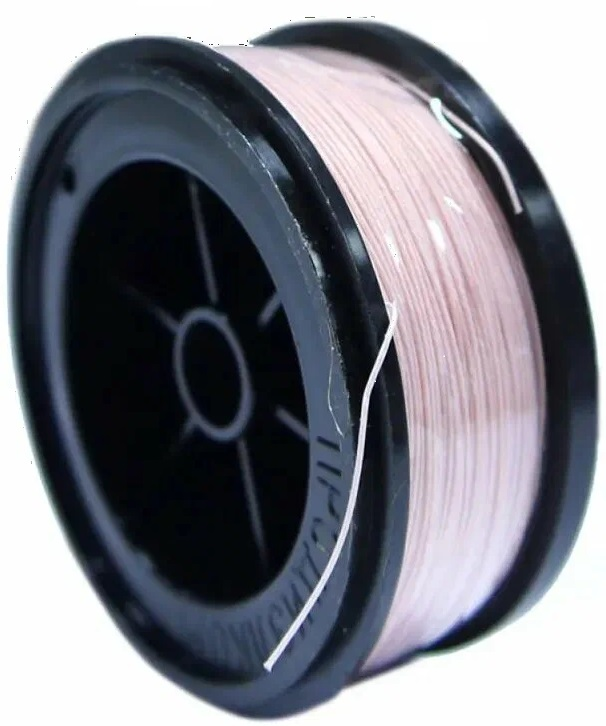
</td>
    <td>
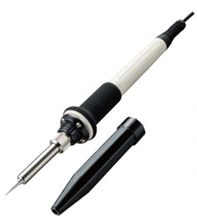
</td>
  </tr>
</table>

Сonnection diagram:

<table width="50%" border="0" align="center">
  <tr>
    <td>
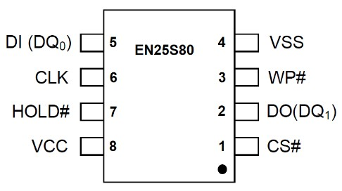
</td>
    <td>
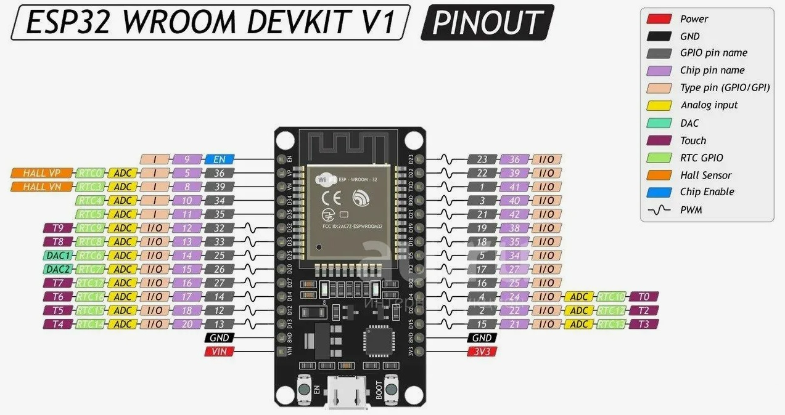
</td>
  </tr>
</table>

&nbsp;

<table width="23%" border="0" align="center">
  <tr>
    <th width="8%" class="style1" scope="col">#</th>
    <th width="31%" class="style1" scope="col">ESP32</th>
    <th width="61%" class="style1" scope="col">Nartis-D101</th>
  </tr>
  <tr>
    <td class="style1">
1
</td>
    <td class="style1">
D23
</td>
    <td class="style1">
DI   EN26S80 (5 pin)
</td>
  </tr>
  <tr>
    <td class="style1">
2
</td>
    <td class="style1">
D18
</td>
    <td class="style1">
CLK   EN26S80 (6 pin)
</td>
  </tr>
  <tr>
    <td class="style1">
3
</td>
    <td class="style1">
VIN
</td>
    <td class="style1">
+5V  USB
</td>
  </tr>
  <tr>
    <td class="style1">
4
</td>
    <td class="style1">
GND
</td>
    <td class="style1">
GND
</td>
  </tr>
</table>

Connection photo:

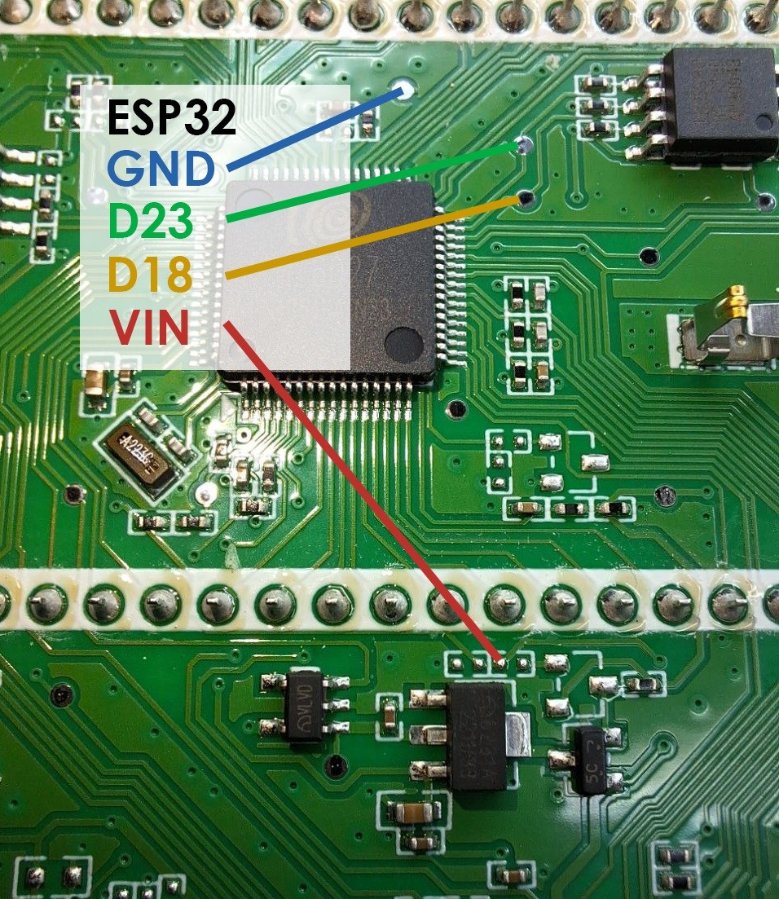

As it turned out, the ESP32 fits perfectly in the dimensions of the battery compartment, so it can be placed directly inside the Nartis-D101 by printing the case on a 3D printer:

<table width="30%" border="0" align="center">
  <tr>
    <th scope="col">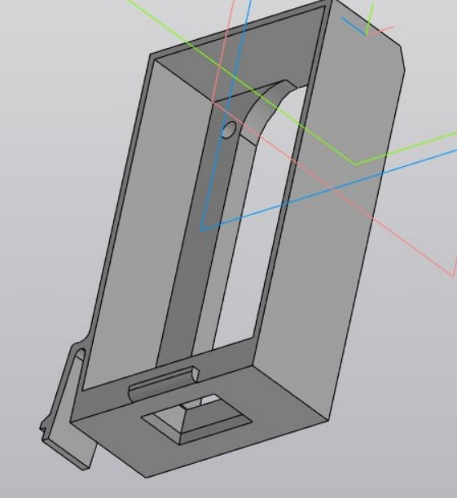</th>
    <th scope="col">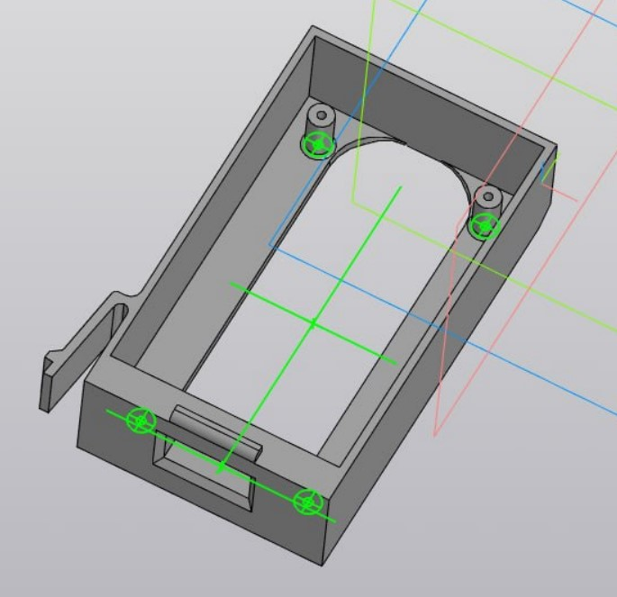</th>
  </tr>
</table>

The ESP32 can also be positioned outside, and it is convenient to use a 4-pin audio jack for this:

<table width="50%" border="0" align="center">
  <tr>
    <th scope="col">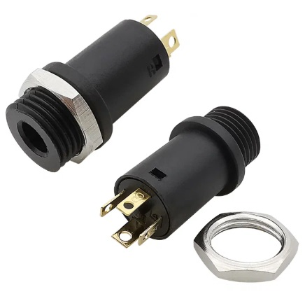</th>
    <th scope="col">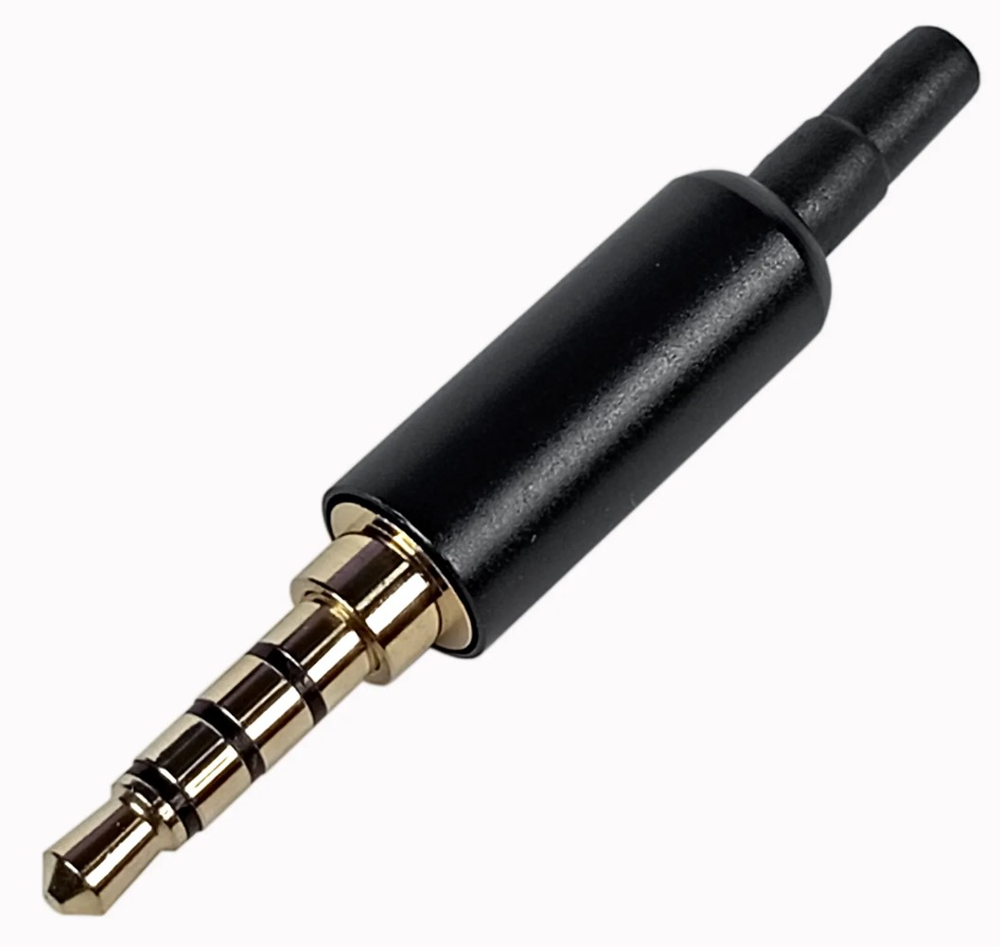</th>
    <th scope="col">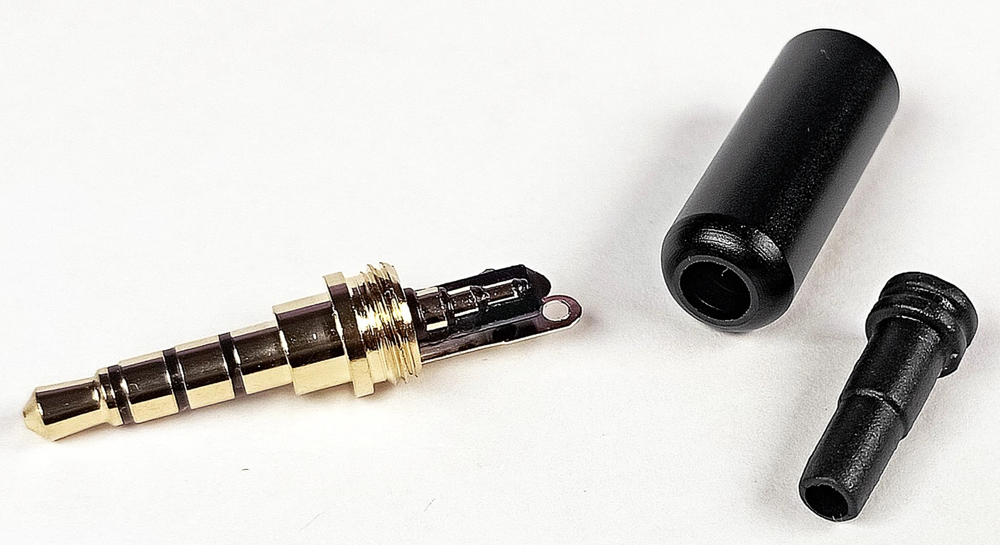</th>
  </tr>
</table>

Important: when soldering connections, try to make the wires as short as possible! 

Software: 

1. Arduino IDE v2.3.8 

2. ESP32 by Espressif Systems v3.3.8 

3. PubSubClient by Nick O'Leary v2.8 

Before compiling the project, select the ESP32 Dev Module board. Board parameters for this scetch:

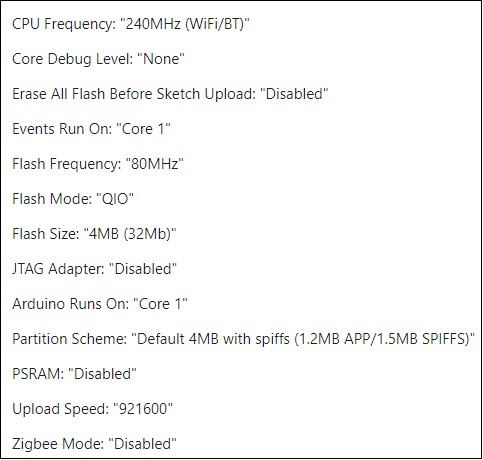

Important: it is necessary to provide sufficient +5V power on the USB port, as it simultaneously powers the external display and the ESP32 module! 

For easy integration with the Home Assistant, the Autodiscovery function is used, while the device is automatically registered with MQTT. 

It is also recommended to use a timestamp to monitor the module's health. Just add the following lines to the configuration.yaml file:

template: 
  &nbsp; &nbsp;- sensor: 
  &nbsp; &nbsp; &nbsp; &nbsp;-  name: &quot;Timestamp&quot; 
  &nbsp; &nbsp; &nbsp; &nbsp;  &nbsp;unique_id: NartisTimestamp 
  &nbsp; &nbsp; &nbsp; &nbsp;  &nbsp;state: &quot;{{ states.sensor.nartis_d101_total.last_updated }}&quot; 
  &nbsp; &nbsp; &nbsp; &nbsp;  &nbsp;device_class: timestamp

An example of a card in the Home Assistant:

&nbsp;

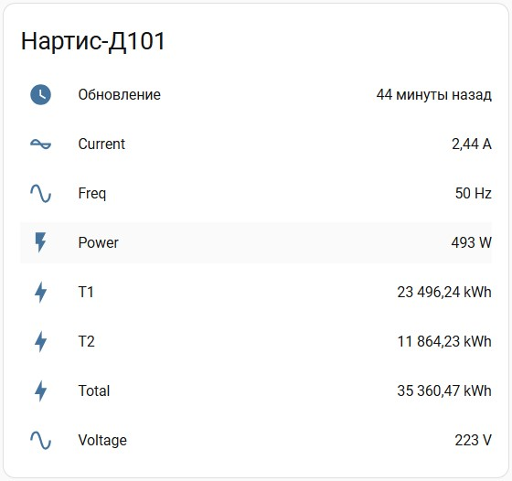

Before filling in the sketch, set the parameters of your WiFi network and MQTT broker in the nartis_d101.ino file:

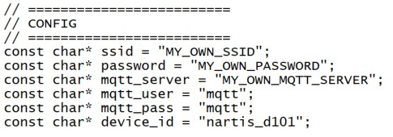

Good luck in implementing your ideas!

</body>
</html>
